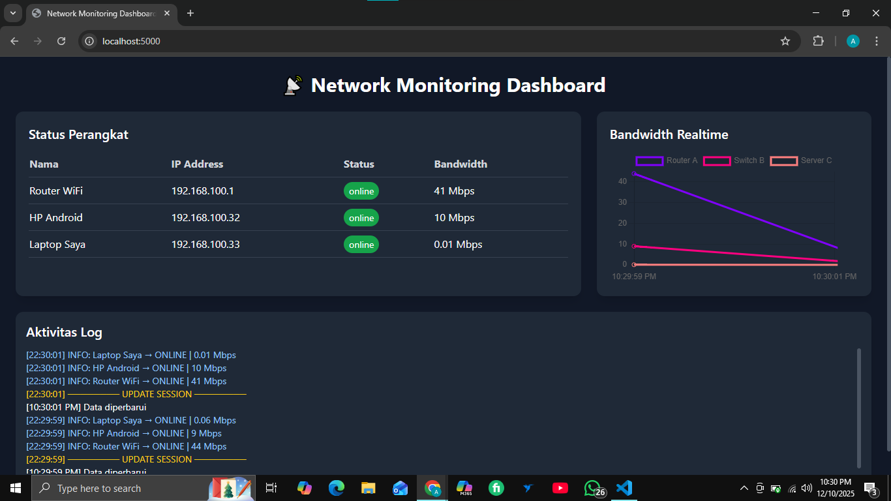
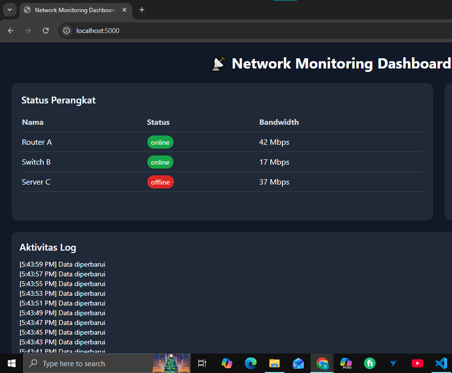
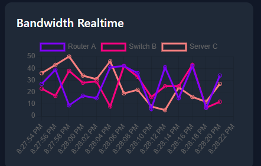

# 📡 Network Monitoring Dashboard (Real Device)

Tugas Mata Kuliah: **Komunikasi Data**  
Nama: **Rifaldi Ahmad Rehan** |
NIM: **241091900397**

Aplikasi monitoring jaringan real-time menggunakan **Flask + Socket.IO** dengan data yang diambil dari **perangkat nyata**:

- **Router WiFi** → ICMP Ping  
- **HP Android** → ICMP Ping  
- **Laptop** → Bandwidth asli via psutil  

Dashboard menampilkan status perangkat, grafik bandwidth, dan log aktivitas yang diperbarui otomatis setiap **2 detik**.

---

## Fitur Utama

- Monitoring real-time (WebSocket)
- Status online/offline perangkat real
- Bandwidth asli dari laptop
- Log aktivitas otomatis

---

## Struktur Folder

```
network-monitoring-dashboard/
│
├── app.py
├── device.py
├── requirements.txt
├── Readme.md
│
├── templates/
│   └── index.html
│
└── static/
    ├── css/
    │   └── style.css
    ├── js/
    |   └── main.js
    └── img/
        ├── chart_update.png
        ├── dashboard.png
        └── table_update.png
```

---

## Instalasi

Pastikan Python 3 sudah terinstall.

### Install dependencies
Jalankan:

```
pip install -r requirements.txt
```

Atau manual:

```
pip install flask flask-socketio eventlet psutil
```

---

## Cara Menjalankan Aplikasi

Di terminal:

```
python app.py
```

Jika berhasil, server akan berjalan di:

```
http://localhost:5000
```

Buka browser untuk melihat dashboard realtime.

---

## Endpoint REST API

### **GET /api/history**
Mengembalikan riwayat status perangkat dalam format JSON.

Contoh:

```json
[
  {
    "time": "2025-12-04T19:20:54",
    "data": [
      {"name": "Router WiFi", "IP Address": "192.168.100.1", "status": "online", "bandwidth": 12},
      {"name": "HP Android", "IP Address": "192.168.100.32", "status": "offline", "bandwidth": 0},
      {"name": "Laptop Saya", "IP Address": "192.168.100.33", "status": "online", "bandwidth": 25}
    ]
  }
]
```

---

## Screenshot Realtime

### 1. Dashboard Saat Pertama Dibuka


### 2. Update Status & Bandwidth (Realtime)


### 3. Grafik Bandwidth Bergerak Real-Time


---

## Penjelasan Arsitektur Aplikasi

Aplikasi menggunakan arsitektur **Client–Server dengan kombinasi REST API dan WebSocket**.

- Frontend: HTML + Tailwind + Chart.js + Socket.IO Client  
- Backend: Flask + Socket.IO  
- Background task mengumpulkan:
  - Ping Router
  - Ping HP
  - Bandwidth laptop  

---

## Diagram Arsitektur

```
                ┌────────────────────┐
                │     Browser UI     │
                │   (Client Side)    │
                │                    │
                │ HTML + CSS + JS    │
                │ Chart.js + SocketIO│
                └──────────┬─────────┘
                           │
                 WebSocket │  REST API
                           │
                ┌──────────▼─────────┐
                │     Flask Server    │
                │   (app.py)          │
                │  - SocketIO, bg task│
                │  - Rest API         │
                └──────────┬─────────┘
                           │
                           ▼
                ┌────────────────────┐
                │    devices.py       │
                │  - Ping Router      │
                │  - Ping HP Android  │
                │  - Bandwidth Laptop │
                └────────────────────┘
```

---

## Identitas

Nama: Rifaldi Ahmad Rehan |
NIM: 241091900397 |
Kelas: 03SKMM003

---


